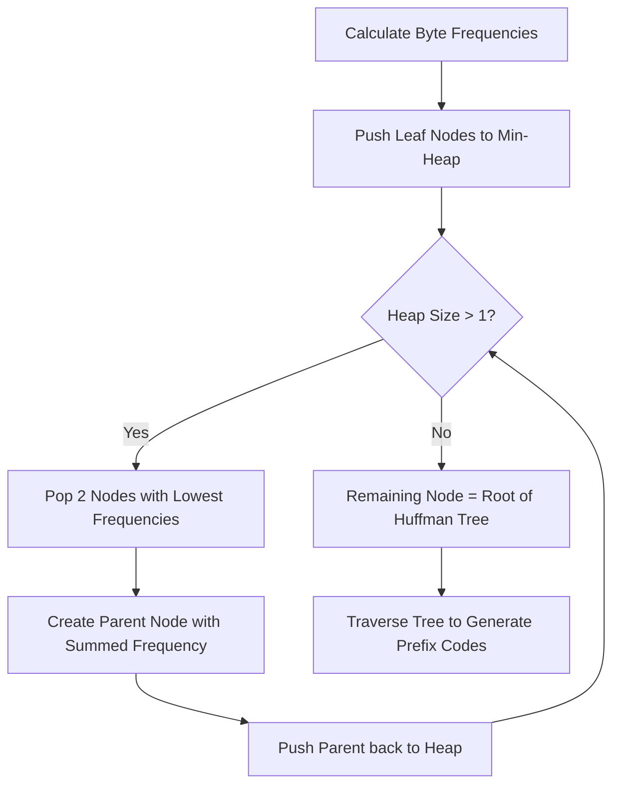

# Huffman Coding File Compression System

A lightweight, general-purpose file compression and decompression utility built in Python using **Huffman Coding**. This project demonstrates practical applications of fundamental data structures—**Binary Trees** and **Priority Queues (Min-Heaps)**—to achieve lossless data compression.

Suitable as a college **Data Structures and Algorithms (DSA) mini-project**.

---

## 📄 Project Overview
This project implements the classical Huffman Coding algorithm at the **raw byte level**, meaning it can compress any file type (text files, images, executables, etc.) rather than just ASCII text. It features an interactive command-line interface (CLI) to run terminal demos or compress/decompress physical files on disk.

### Expected Resume Description
> *"Developed a lossless text compression system using Huffman Coding in Python. Implemented Binary Trees and Priority Queues to generate optimal prefix codes for efficient text compression and decompression."*

---

## 🛠️ Key Features
* **Byte-Level Compression**: Handles raw binary data, ensuring compatibility with all file formats and OS-specific line endings (LF vs CRLF).
* **True Bit-Packing**: Compresses data by packing variable-length binary codes into actual, compact bytes on disk.
* **Custom Binary File Format**: Serializes character/byte frequency tables directly into the file header using a JSON-metadata wrapper for instant decompression.
* **Interactive CLI**: Menu-driven interface supporting interactive text testing and file-to-file processing.
* **Zero Dependencies**: Written entirely in Python using standard libraries only (`collections`, `heapq`, `json`, `os`).

---

## 📚 How It Works (DSA Concepts Explained)

Huffman coding is a **greedy algorithm** that assigns variable-length codes to input bytes based on their frequencies. More frequent bytes get shorter codes, while less frequent bytes get longer codes.



### 1. Priority Queues (Min-Heaps)
The algorithm uses a Min-Heap (via Python's `heapq` module) to maintain the tree nodes. 
* Each unique byte starts as a leaf node, with its frequency as its priority.
* We repeatedly extract the two nodes with the lowest frequencies, merge them into a parent node whose frequency is the sum of the children's frequencies, and push the parent back into the heap.
* This process repeats until only one node remains: the **Root of the Huffman Tree**.

### 2. Binary Trees
The resulting structure is a Binary Tree:
* **Leaf Nodes**: Contain the actual byte values.
* **Internal Nodes**: Contain combined frequencies.
* **Edge Routing**: Traversing left represents a `0` bit, and traversing right represents a `1` bit.
* **Prefix Property**: Because characters only exist at the leaf nodes, no binary code is a prefix of another (e.g., if `A` is `01`, no other character code will start with `01`). This makes the bitstream uniquely decodable without delimiters.

---

## 💾 Custom Binary File Format Layout
When a file is compressed, it is written to disk as a binary `.huff` file. The layout is structured as follows:

| Field | Size | Data Type | Description |
|---|---|---|---|
| **Metadata Size** | 4 Bytes | Big-Endian Integer | Length ($N$) of the serialized JSON frequency table. |
| **Padding Length** | 1 Byte | Big-Endian Integer | Number of padding bits (0–7) appended to align the final byte. |
| **Frequency Table** | $N$ Bytes | UTF-8 JSON String | Serialized byte-frequency dictionary used to reconstruct the tree. |
| **Packed Payload** | Remaining | Binary stream | The actual Huffman-coded bitstream packed into raw bytes. |

---

## 🚀 How to Run

### Prerequisite
Make sure Python is installed. You can check your version with:
```cmd
python --version
```

### Setup & Execution
1. Clone or download this folder.
2. Open **Command Prompt** (cmd) or **PowerShell** and navigate to the folder:
   ```cmd
   cd "c:\Users\lenovo\OneDrive\Documents\SHREYA\projects with antigravity"
   ```
3. Run the script:
   ```cmd
   python huffman.py
   ```
   *(If `python` is not in your global path, run using your absolute Python interpreter path:)*
   ```cmd
   "C:\Users\lenovo\AppData\Local\Google\Cloud SDK\google-cloud-sdk\platform\bundledpython\python.exe" huffman.py
   ```

---

## 📊 Sample Execution Logs

### 1. Interactive Demo (Option 1)
```text
Select an option (1-4): 1

Enter text to compress: hello

============================================================
                    COMPRESSION RESULTS
============================================================
Original Text        : "hello"
Encoded Binary String: 1001111100
Decoded Text         : "hello"

------------------------------------------------------------
                         METRICS
------------------------------------------------------------
Original Size        : 40 bits (5 bytes)
Compressed Size      : 10 bits
Compression Saved    : 75.00%

Huffman Codes Dictionary:
  'o'        : 00
  'e'        : 01
  'h'        : 10
  'l'        : 11
============================================================
```

### 2. File Compression (Option 2)
```text
Select an option (1-4): 2

Enter the path of the file to compress: sample.txt

[Success] Compressed successfully!
  Original File   : sample.txt (462 bytes)
  Compressed File : sample.txt.huff (672 bytes)
  Physical Savings: -45.45%
```
> [!NOTE]
> For very small files (under 1 KB), the JSON frequency table in the header takes up a significant proportion of the size, which is why physical savings might appear negative. 

### 3. Large File Savings Verification
For larger files (e.g. 46 KB), the header overhead becomes negligible:
```text
[Success] Compressed successfully!
  Original File   : large_sample.txt (46700 bytes)
  Compressed File : large_sample.txt.huff (27017 bytes)
  Physical Savings: 42.15%
```

---

## 📈 Complexity Analysis

Let $N$ be the number of characters in the input text, and $K$ be the number of unique characters (max 256 for byte-level).

* **Time Complexity**:
  * **Frequency Calculation**: $O(N)$
  * **Tree Construction**: $O(K \log K)$ (Inserting and popping from the Priority Queue takes $O(\log K)$ per operation).
  * **Code Generation**: $O(K)$ (Traversal of the binary tree).
  * **Compression / Decompression**: $O(N)$
  * **Overall Time**: $O(N + K \log K)$ (Since $K \le 256$, this simplifies to $O(N)$ in practice).

* **Space Complexity**:
  * **Huffman Tree**: $O(K)$ nodes.
  * **Code Table**: $O(K)$ storage.
  * **Overall Auxiliary Space**: $O(K)$ (Very memory-efficient!).

---

## 👥 Authors
* **Shreya Srivastava** - [GitHub Profile](https://github.com/ShreyaSrivastava9)
